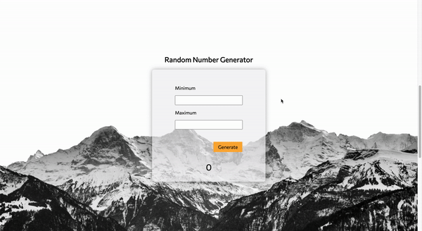
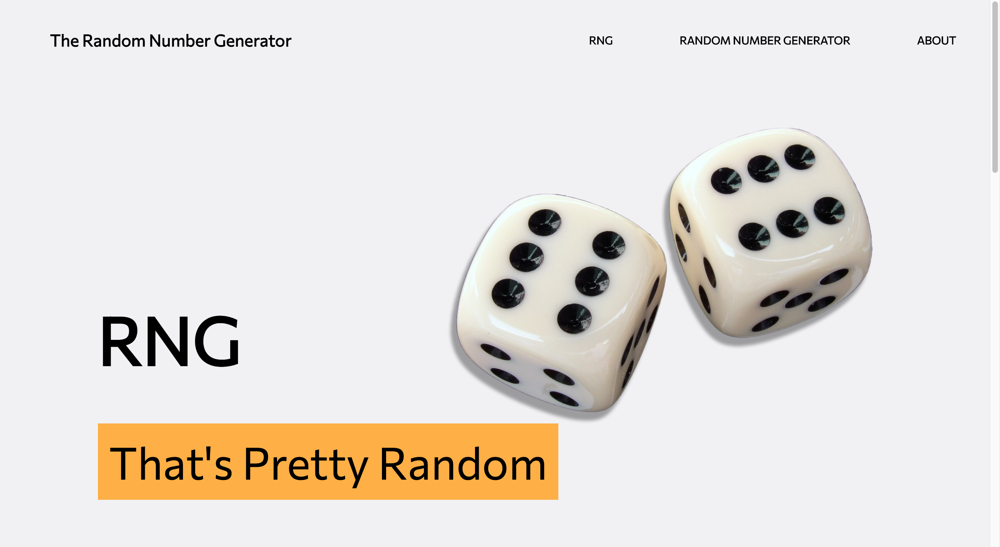
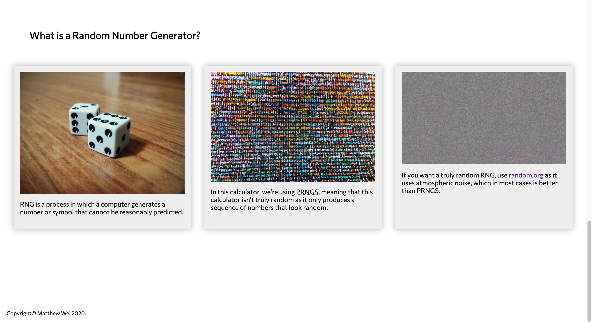

# Random Number Generator

## Description
A random number generator website using HTML, CSS, and JavaScript.

#### WORK IN PROGRESS
* Plans to make it responsive.

#### Project Motivation
I wanted to build a random number generator because I utilize them when I do not know what to choose in a given selection. The reason for this is because of overchoice. Overchoice is a cognitive impairment in which people have a difficult time making a decision when faced with many options. My goal is to use the skills I learned in my Term 1 class and to create something that I can show to my peers.

## How to Use
1. Goto the Github Pages I currently have the random number generator on [here](https://matthewwei35.github.io/random-number-generator/).
2. Scroll down the page until you see the random number generator form.
3. Enter in a minimum and maximum number in the fields of the same name.
4. Click the yellow generate button to get a random number displayed.

## Screenshots

